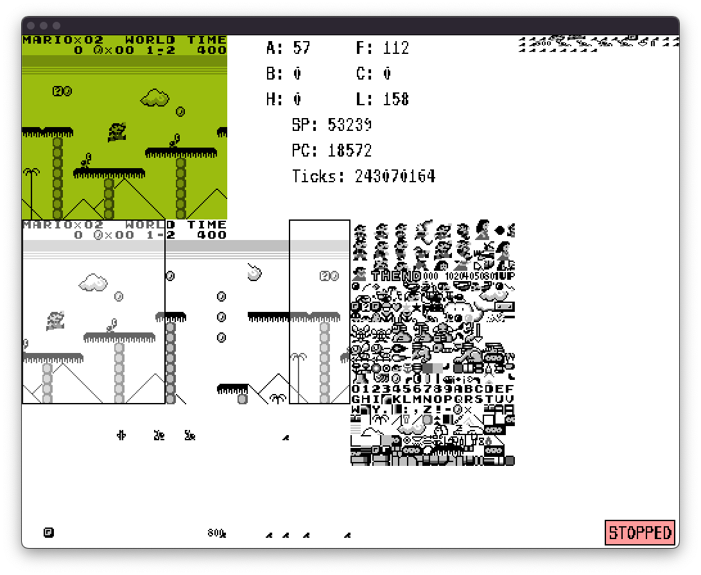

# GameBoy Emulator

This is a simple gameboy emulator that I'm writing to learn more about the world of emulation. This emulator has nothing special and has no extra features compared to other DMG emulators.



## Usage
To build the project, `cmake`, `SDL2` and `SDL2 ttf` are required. The SDL2 cmake files are already included, as in some systems cmake can't find the packages. The emulator was tested on Linux and MacOS.

### Building
```
$ mkdir build && cd build
$ cmake ..
$ make
```
    
### Running
```
usage: ./GameBoy --rom <rom_file> [--bootrom <bootrom_file>] [--debug]

arguments:
  --rom                     Standard GameBoy rom
  --bootrom                 Official DMG bootrom
  --debug                   Enable the debugger
```


## Input
<table>
<tr><th> Gameplay </th><th>Debug</th></tr>
<tr><td>

| Action | Key |
| --- | --- |
| UP | <kbd>↑</kbd> |
| DOWN | <kbd>↓</kbd> |
| LEFT | <kbd>←</kbd> |
| RIGHT | <kbd>→</kbd> |
| B | <kbd>X</kbd> |
| A | <kbd>Z</kbd> |
| START | <kbd>Space</kbd> |
| SELECT | <kbd>Enter</kbd> |
</td><td>

| Action | Key |
| --- | --- |
| Normal color palette | <kbd>1</kbd> |
| Retro color palette | <kbd>2</kbd> |
| Pause/Resume | <kbd>p</kbd> |
| Step | <kbd>s</kbd> |
| Exit | <kbd>Escape</kbd> |

</td></tr> </table>


## Features

- Correct instruction timings
- Correct interrupt timings
- Sprites and window
- Memory Banks: MBC0 and MBC1
- Debug mode

Currently, the main missing feature is `sound`, which I refuse to touch.