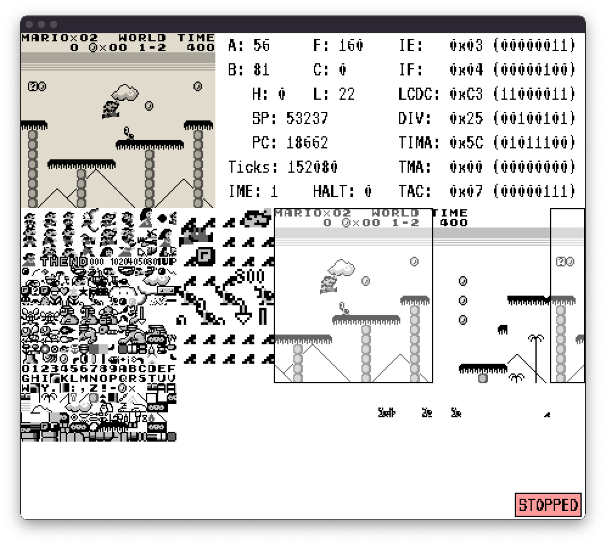
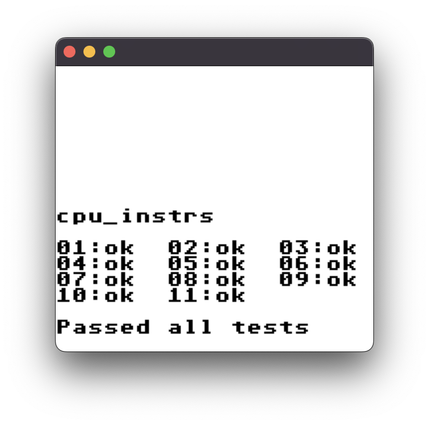
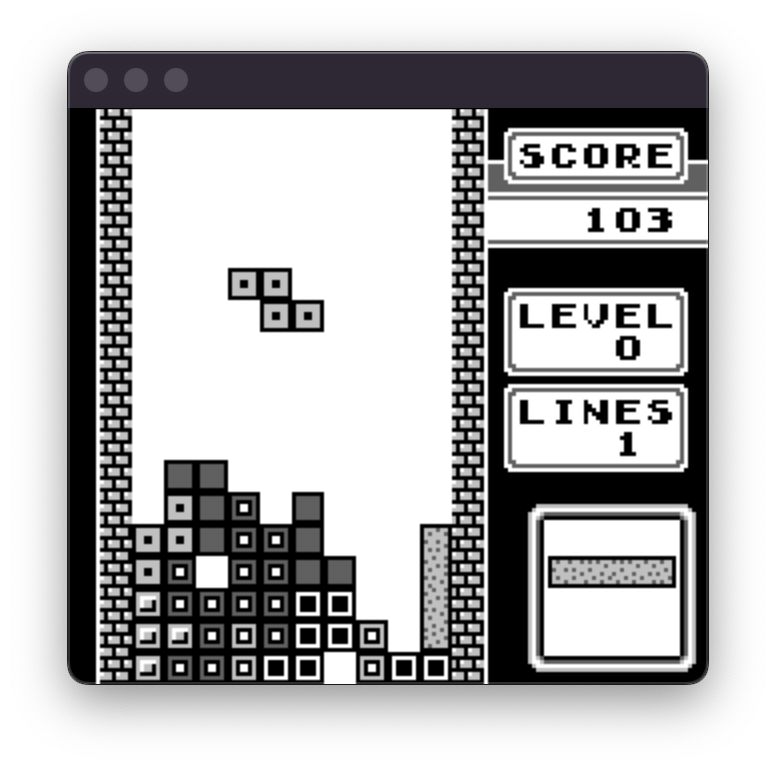
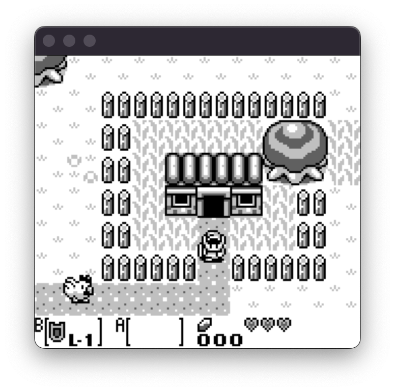
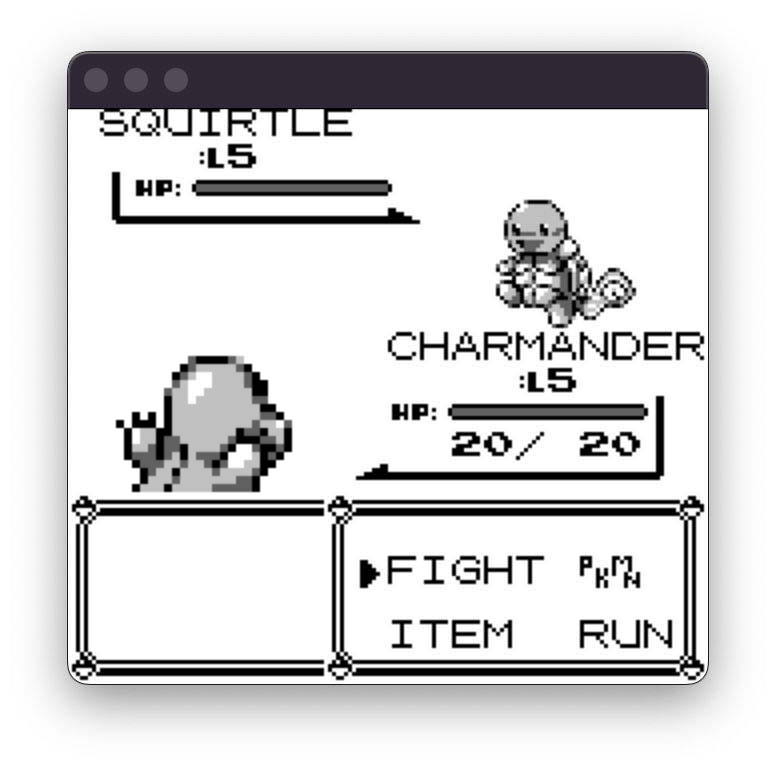
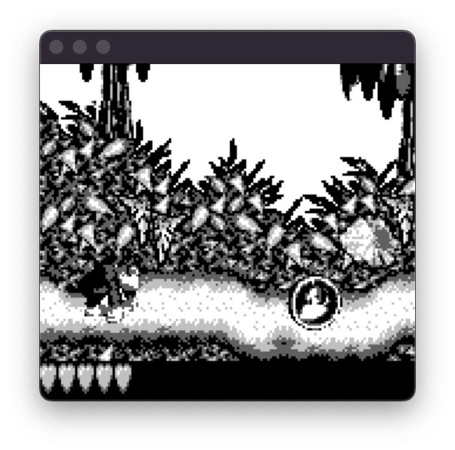
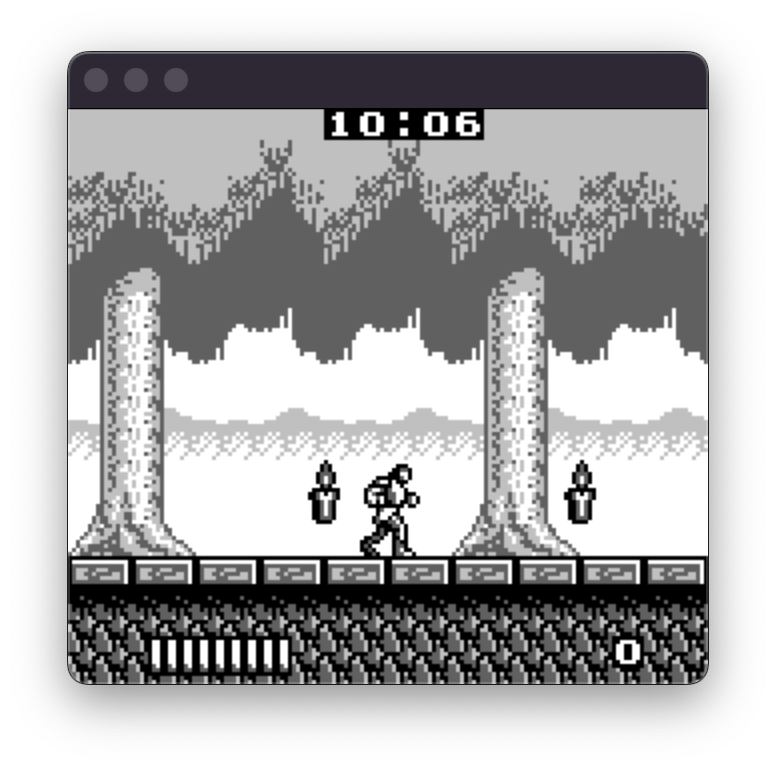

# NoobBoy - GameBoy Emulator

NoobBoy is a simple gameboy emulator that I'm writing to learn more about the world of emulation. This emulator has nothing special and has no extra features compared to other DMG emulators.



## Usage
To build the project, `cmake`, `SDL2` and `SDL2 ttf` are required. The SDL2 cmake files are already included, as in some systems cmake can't find the packages. The emulator was tested on Linux and MacOS.

### Building
```
$ cmake .
$ make
```
    
### Running
```
usage: ./GameBoy --rom <rom_file> [--bootrom <bootrom_file>] [--load-save <save_file>] [--debug]

arguments:
  --rom                     Standard GameBoy rom
  --bootrom                 Official DMG bootrom
  --debug                   Enable the debugger
  --load-save               Save file to load
```


## Input
<table>
<tr><th> Gameplay </th><th>Debug</th></tr>
<tr><td>

| Action | Key |
| --- | --- |
| UP | <kbd>↑</kbd> |
| DOWN | <kbd>↓</kbd> |
| LEFT | <kbd>←</kbd> |
| RIGHT | <kbd>→</kbd> |
| B | <kbd>x</kbd> |
| A | <kbd>z</kbd> |
| START | <kbd>Space</kbd> |
| SELECT | <kbd>Enter</kbd> |
</td><td>

| Action | Key |
| --- | --- |
| Save game | <kbd>s</kbd> |
| Toggle color palette | <kbd>c</kbd> |
| Pause/Resume | <kbd>p</kbd> |
| CPU step | <kbd>n</kbd> |
| Exit | <kbd>Escape</kbd> |

</td></tr> </table>


## Features

- Correct instructions and PPU timings
- Correct scanline timing
- Sprites with correct row limitations
- Correct sprite, window and background pixel priority
- VRAM rendering with X/Y scroll overlay
- Memory Bank Controller (MBC)
- Debug mode
- Save states (dump of external RAM banks)

Currently, the main missing feature is `sound`, which I refuse to touch. Additionally, the `halt bug` is missing because of the incorrect interrupt timings.


## Game Screenshots


|   |   |
|:---:|:---:|
|  |   | 
| *Blargg's CPU Instructions Test* | *Tetris* |
|  |   | 
| *The Legend of Zelda - Link's Awakening* |*Pokemon Blue* |
|  |   | 
| *Donkey Kong Land* |*Castlevania* |


**_NOTE:_**  Some games may not work due to some missing MBC features.
